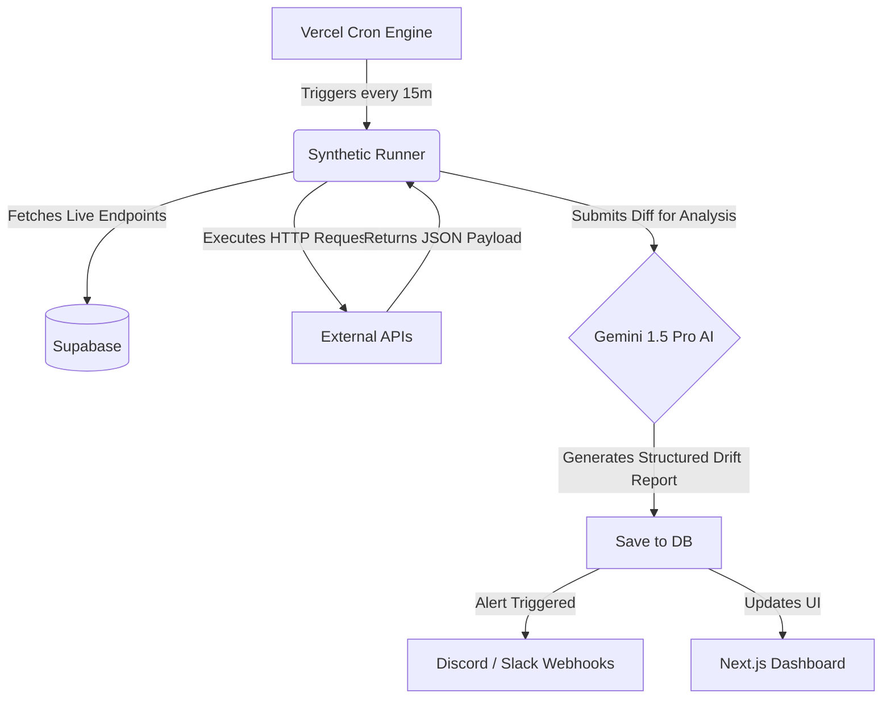

# ⚡ AuditPulse

**Automated API Contract & Schema Drift Sentinel**

AuditPulse is an autonomous, AI-powered health monitoring pipeline. Register your internal or external API endpoints, configure a cron schedule, and AuditPulse will continuously monitor them. Using **Google Gemini 1.5 Pro** and Structured Outputs, it acts as an intelligent sentinel—detecting silent schema mutations, breaking type changes, latency regressions, and security anomalies (e.g., leaked internal stack traces or PII).


---

## 🎯 The Problem
Standard uptime monitors (like Pingdom or DataDog) only tell you if an endpoint is returning a `200 OK`. They are completely blind to **silent schema drifts**:
- An engineering team silently changes a user `id` field from a `string` to a `number`.
- A critical auth token is suddenly returned as `null`.
- A 500 error leaks an internal database stack trace into the JSON response.

Your applications crash downstream, but the monitor is still green.

## 🚀 The Solution
AuditPulse fetches the live response payload and compares it against historical baselines using Gemini AI. If a breaking mutation occurs, AuditPulse categorizes the severity, generates a patched TypeScript interface, and immediately fires a webhook alert to Discord or Slack.

## 🧠 Architecture Flow



## ✨ Key Features
- **Interactive Drift Playground:** Test breaking changes live before you even log in.
- **Auto-Generated Contracts:** AuditPulse automatically generates the patched TypeScript interface so developers can copy/paste fixes instantly.
- **Visual Payload Diffs:** Side-by-side JSON highlighting of mutations.
- **Discord & Slack Webhooks:** Color-coded rich embed alerts triggered immediately on failure.
- **Secure GitHub Auth:** Multi-tenant endpoint isolation powered by Supabase SSR.

---

## 🛠 Local Development Setup

1. **Clone the repository and install dependencies:**
   ```bash
   git clone https://github.com/lakshay/auditpulse.git
   cd auditpulse
   npm install
   ```

2. **Set up Environment Variables:**
   Copy `.env.example` to `.env` and fill in your keys:
   ```bash
   cp .env.example .env
   ```
   *Required Keys:*
   - `NEXT_PUBLIC_SUPABASE_URL`
   - `NEXT_PUBLIC_SUPABASE_ANON_KEY`
   - `SUPABASE_SERVICE_ROLE_KEY`
   - `GEMINI_API_KEY`
   - `CRON_SECRET`

3. **Run the Database Schema:**
   Execute `supabase/schema.sql` in your Supabase SQL Editor to generate the `projects`, `endpoints`, `snapshots`, and `drift_alerts` tables.

4. **Launch the Application:**
   ```bash
   npm run dev
   ```
   Access the dashboard at `http://localhost:3000`.

## 📜 License
This project is open-source and available under the [MIT License](LICENSE).
